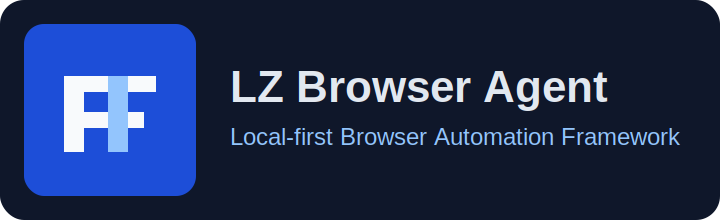
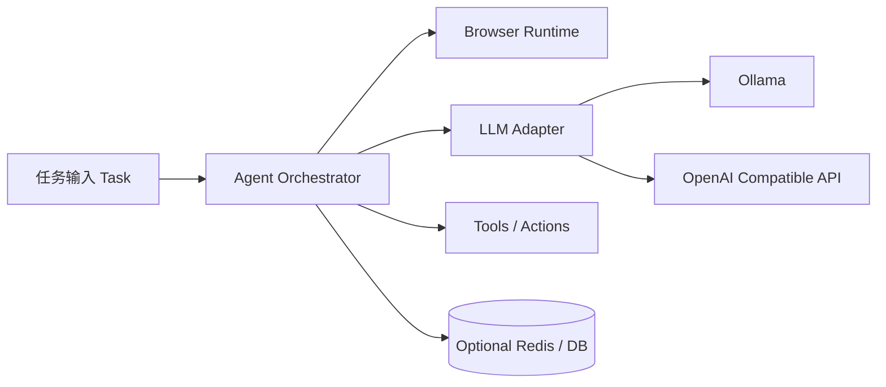

# 本地浏览器智能体框架｜LZ Browser Agent

<p align="center">
  
</p>

🔥 面向本地与私有化场景的浏览器自动化智能体框架（Local-first Browser Automation Agent）。  
🚀 支持 `OpenAI Compatible API`、`Ollama`、多模型切换、可扩展工具调用与自动化任务编排。  
⭐ 适合作为“可二开、可部署、可工程化”的浏览器智能体项目基座。

<p align="center">
  
  
  
  
</p>

---

## 目录

- [1. 项目定位](#1-项目定位)
- [2. 核心能力](#2-核心能力)
- [3. 架构概览](#3-架构概览)
- [4. 快速开始](#4-快速开始)
- [5. 本地配置说明](#5-本地配置说明)
- [6. 项目结构](#6-项目结构)
- [7. 与原版的差异](#7-与原版的差异)
- [8. 部署方式](#8-部署方式)
- [9. 常见问题](#9-常见问题)
- [10. 许可证与合规说明](#10-许可证与合规说明)

---

## 1. 项目定位

`LZ Browser Agent` 是在 `browser-use` 基础上的工程化二次开发版本，目标是：

1. 更适合中文开发环境与本地部署。
2. 更适合接入私有 API 网关、Ollama、本地 Redis/数据库扩展。
3. 更强调“仓库可接管、可换名、可长期维护”的项目落地能力。

该仓库面向以下场景：

- 个人开发者构建浏览器自动化助手
- 团队内部的流程自动化（抓取、填报、校验、数据提取）
- 课程设计、毕业设计、工程实践项目的二开底座

---

## 2. 核心能力

### 2.1 浏览器自动化 Agent

- 基于自然语言任务驱动浏览器行为
- 支持多步任务执行、页面元素交互、信息提取
- 支持从脚本调用到 CLI 调用的统一能力

### 2.2 多模型支持（Multi-LLM）

- `ChatOllama`：本地模型推理
- `OpenAI Compatible`：可接 OneAPI / vLLM / SiliconFlow 等兼容接口
- 可按任务类型扩展 Anthropic / Google / Azure 等提供方

### 2.3 本地优先配置（Local-first）

- 提供统一 `.env` 模板
- 支持本地 `DATABASE_URL` / `REDIS_URL` 预留配置
- 支持 `BROWSER_USE_OLLAMA_HOST` 与 `BROWSER_USE_OLLAMA_MODEL`

### 2.4 示例配置抽离（已改造）

- 新增 `examples/common/local_runtime.py`
- `examples/models/ollama.py` 已改为从环境变量加载默认任务、模型与 Host

---

## 3. 架构概览



---

## 4. 快速开始

### 4.1 环境要求

- Python `3.11+`
- 推荐包管理器：`uv`
- 已安装 Chromium/Chrome（或按项目提示安装）

### 4.2 安装

```bash
uv init
uv sync
```

### 4.3 初始化环境变量

```bash
cp .env.example .env
```

至少配置以下项：

- `OPENAI_API_KEY`（若使用 OpenAI 兼容接口）
- `OPENAI_BASE_URL`（可接本地/私有网关）
- 或 `BROWSER_USE_OLLAMA_HOST` + `BROWSER_USE_OLLAMA_MODEL`

### 4.4 运行 Ollama 示例

```bash
python examples/models/ollama.py
```

---

## 5. 本地配置说明

`.env.example` 已按本地私有化场景改写，重点变量如下：

| 变量 | 作用 | 示例 |
|---|---|---|
| `OPENAI_BASE_URL` | OpenAI 兼容网关地址 | `http://127.0.0.1:8000/v1` |
| `BROWSER_USE_OLLAMA_HOST` | Ollama 服务地址 | `http://127.0.0.1:11434` |
| `BROWSER_USE_OLLAMA_MODEL` | 默认 Ollama 模型 | `qwen2.5:7b-instruct` |
| `DATABASE_URL` | 业务扩展数据库连接 | `postgresql://...` |
| `REDIS_URL` | 缓存/会话存储扩展连接 | `redis://127.0.0.1:6379/0` |
| `ANONYMIZED_TELEMETRY` | 匿名统计开关 | `false` |

---

## 6. 项目结构

```text
.
├── browser_use/                 # 核心运行时与能力模块
├── examples/
│   ├── common/local_runtime.py  # 本地配置加载（新增）
│   └── models/ollama.py         # Ollama 示例（已改造）
├── static/lz-browser-agent-logo.svg
├── docs/repository-profile.md
├── .env.example
├── pyproject.toml
└── README.md
```

---

## 7. 与原版的差异

当前版本重点做了工程接管层面的改造：

1. 项目元信息已切换为个人仓库可维护形式（`pyproject.toml`）。
2. 新增 fork 友好的 CLI 命令别名：`lz-browser-agent`、`lzb`。
3. `.env.example` 改为本地化模板，补齐数据库/Redis/Ollama 配置。
4. 新增品牌 Logo 与仓库品牌文档（名称、描述、Topics 推荐）。
5. 新增自定义许可证文件：`LICENSE-COMMUNITY.md`。
6. 示例脚本完成一处配置抽离，降低重复硬编码。

---

## 8. 部署方式

### 8.1 本地开发部署

- 适合功能验证、二次开发与调试
- 直接使用 `uv` + `.env` 启动

### 8.2 私有服务器部署

- 通过 Docker 或进程守护工具运行
- 将 `OPENAI_BASE_URL` 指向企业网关
- 使用 `REDIS_URL`/`DATABASE_URL` 承接状态与业务扩展

### 8.3 团队协作部署

- 推荐将配置拆分为 `.env.dev` / `.env.staging` / `.env.prod`
- 建议在 CI 中统一注入密钥，不在仓库提交真实凭据

---

## 9. 常见问题

### 9.1 Ollama 无法连接

优先检查：

1. `ollama serve` 是否运行
2. `BROWSER_USE_OLLAMA_HOST` 是否可访问
3. 模型是否已 pull（如 `qwen2.5:7b-instruct`）

### 9.2 页面操作不稳定

建议：

1. 优先使用更稳定的元素定位策略
2. 在任务中增加等待与重试策略
3. 对高风险步骤加入人工确认机制

### 9.3 私有 API 报错

建议确认：

1. `OPENAI_BASE_URL` 是否带 `/v1`
2. 鉴权头与 Key 格式是否符合网关要求
3. 模型名称是否与网关配置一致

---

## 10. 许可证与合规说明

- 本仓库保留上游项目的历史许可证文件：`LICENSE`
- 新增自定义协议文件：`LICENSE-COMMUNITY.md`
- 若你进行对外发布，请同时检查第三方依赖许可证条款

在自动化场景下，请确保你的使用行为符合目标网站条款与当地法律法规。
